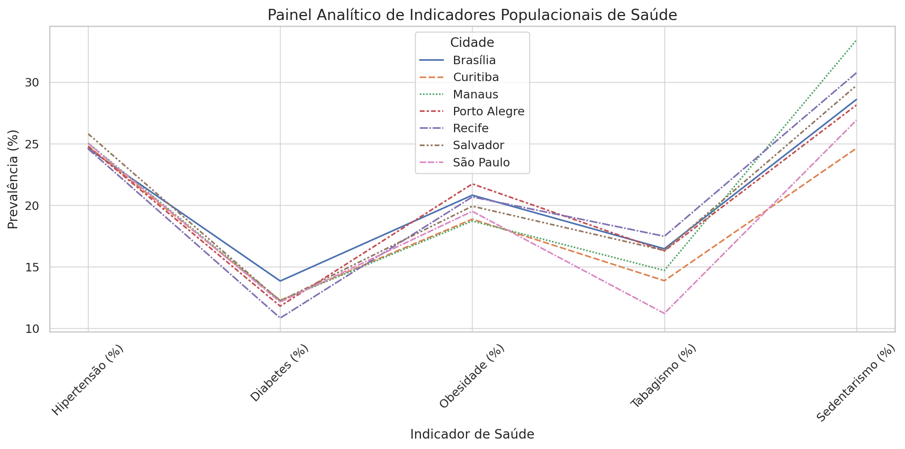

# painel-indicadores-saude
Painel analítico com dados públicos de saúde coletiva.
# Painel Analítico de Indicadores Populacionais de Saúde

Este projeto apresenta um painel visual simples gerado a partir de dados sobre prevalência de condições de saúde em diferentes cidades brasileiras. O objetivo é demonstrar como visualizações claras podem ajudar na definição de estratégias preventivas.

🧠 Indicadores representados
- Hipertensão
- Diabetes
- Obesidade
- Tabagismo
- Sedentarismo

📊 Tecnologias utilizadas
- Python
- Pandas
- Seaborn
- Matplotlib

📷 Exemplo do gráfico gerado

👨‍⚕️ Autor
Dr. Reginaldo Ramos
